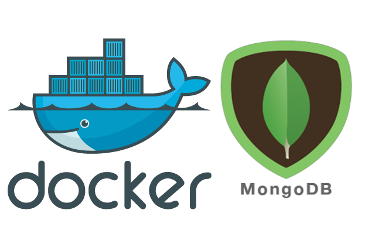
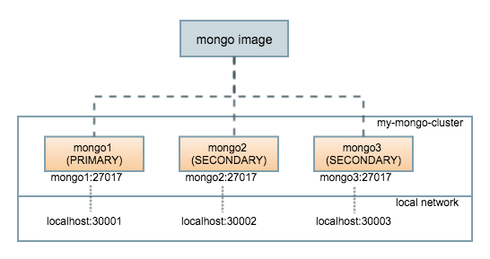

Replication is a technique used my MongoDB to ensure that your data is always backed up for safe keeping, in case one of your database servers decide to crash, shut down or turn into Ultron. Even though replication as a concept sounds easy, it's quite daunting for newcomers to set up their own replica sets, much less containerize them.  
This tutorial is a beginner friendly way to set up your own MongoDB replica sets using docker.

<!-- more -->

## Pre-requisites

The only thing we need installed on our machines is [Docker](https://www.docker.com/products/overview), and.... that's it! We don't even need to install MongoDB to create our replica set, since we can access the shell through our containers itself.

To verify that you have docker installed run :

```sh
docker -v
```

,which should output the version number. Next, we need to make sure our docker daemon is running. So run :

```sh
docker images
```

,which should output the list of images you currently have on your system.  
Next, we will get the latest version of the [official Mongo image](https://hub.docker.com/_/mongo/), by running

```sh
docker pull mongo
```

Great! Now were all set to get up and running.

## Overview

We are going to have 3 containers from the mongo image, all inside their own [docker container network](https://docs.docker.com/engine/userguide/networking/dockernetworks/). Let's name them `mongo1`, `mongo2`, and `mongo3`.
These will be the three mongo instances of our replica set. We are also going to expose each of them to our local machine, so that we can access any of them using the mongo shell interface from our local machine if we need to (you will have to install MongoDB on your own machine to do this). Each of the three mongo container should be able to communicate with all other containers in the network.



## Setting up the network

To see all networks currently on your system, run the command

```
$ docker network ls
NETWORK ID          NAME                DRIVER              SCOPE
2a4e341c6039        bridge              bridge              local
4fbef5286425        host                host                local
8062e4e7cdca        none                null                local
```

We will be adding a new network called `my-mongo-cluster` :

```sh
$ docker network create my-mongo-cluster
```

The new network should now be added to your list of networks :

```txt
$ docker network ls
NETWORK ID          NAME                DRIVER              SCOPE
2a4e341c6039        bridge              bridge              local
4fbef5286425        host                host                local
f65e93c94e42        mongo-cluster       bridge              local
8062e4e7cdca        none                null                local
```

## Setting up our containers

To start up our first container, `mongo1` run the command:

```sh
$ docker run \
-p 30001:27017 \
--name mongo1 \
--net my-mongo-cluster \
mongo mongod --replSet my-mongo-set
```

Let's see what each part of this command does :

- `docker run` : Start a container from an image
- `-p 30001:27017` : Expose port 27017 in our container, as port 30001 on the localhost
- `--name mongo1` : name this container "mongo1"
- `--net my-mongo-cluster` : Add this container to the "my-mongo-cluster" network.
- `mongo` : the name of the image we are using to spawn this container
- `mongod --replSet my-mongo-set` : Run mongod while adding this mongod instance to the replica set named "my-mongo-set"

Set up the other 2 containers by running :

```sh
$ docker run \
-p 30002:27017 \
--name mongo2 \
--net my-mongo-cluster \
mongo mongod --replSet my-mongo-set
$ docker run \
-p 30003:27017 \
--name mongo3 \
--net my-mongo-cluster \
mongo mongod --replSet my-mongo-set
```

> Remember to run each of these commands in a separate terminal window, since we are not running these containers in a detached state

## Setting up replication

Now that we have all our mongo instances up and running, let's turn them into a replica set.

Connect to the mongo shell in any of the containers.

```sh
docker exec -it mongo1 mongo
```

This command will open up the mongo shell in our running mongo1 container (but you can also run it from the mongo2 or mongo3 container as well).

Inside the mongo shell, we first create our configuration :

```js
MongoDB shell version: 2.6.7
> db = (new Mongo('localhost:27017')).getDB('test')
test
> config = {
  	"_id" : "my-mongo-set",
  	"members" : [
  		{
  			"_id" : 0,
  			"host" : "mongo1:27017"
  		},
  		{
  			"_id" : 1,
  			"host" : "mongo2:27017"
  		},
  		{
  			"_id" : 2,
  			"host" : "mongo3:27017"
  		}
  	]
  }
```

The first `_id` key in the config, should be the same as the `--replSet` flag which was set for our mongod instances, which is `my-mongo-set` in our case. We then list all the members we want in our replica set. Since we added all our mongo instances to our docker network. Their name in each container resolver to their respective ip addresses in the `my-mongo-cluster` network.

We finally start the replica set by running

```js
> rs.initiate(config)
{ "ok" : 1 }
```

,in our mongo shell. If all goes well, your prompt should change to something like this :

```
my-mongo-set:PRIMARY>
```

This means that the shell is currently associated with the `PRIMARY` database in our `my-mongo-set` cluster.

Let's play around with our new replica set to make sure it works as intended.
_(I am omitting the `my-mongo-set:PRIMARY>` prompt for readability)_

We first insert a document into our primary database :

```js
> db.mycollection.insert({name : 'sample'})
WriteResult({ "nInserted" : 1 })
> db.mycollection.find()
{ "_id" : ObjectId("57761827767433de37ff95ee"), "name" : "sample" }
```

We then make a new connection to one of our secondary databases (located on mongo2) and test to see if our document get replicated there as well :

```js
> db2 = (new Mongo('mongo2:27017')).getDB('test')
test
> db2.setSlaveOk()
> db2.mycollection.find()
{ "_id" : ObjectId("57761827767433de37ff95ee"), "name" : "sample" }
```

We run the `db2.setSlaveOk()` command to let the shell know that we re intentionally querying a database that is not our primary.
And it looks like the same document is present in our secondary as well.

## Going forward

As you can see, with the power of docker we were able to get a mongo replica set up and running in ~5 minutes. Although this set up is great to experiment and play around with replica sets, there are some precautions to be taken before moving it to production :

- None of the databases have any administrative security measures. Be sure to add users and passwords when deploying this solution on an actual server.
- Keeping all containers on a single server is not the best idea. Run at least one container on a different server and access it through its external ip address and port (in our case the external facing ports for out containers were 30001, 30002, and 30003 for mongo1, mongo2, and mongo3 respectively).
- In case we remove one of our containers by mistake, the data would also vanish. Using [Docker volumes](https://docs.docker.com/v1.10/engine/userguide/containers/dockervolumes/) and setting the appropriate `--dbpath` when running `mongod` would prevent this from happening.

Finally, instead of running a bunch of shell scripts, you may find it more convenient to automate this whole process by using multi-container automation tools like [docker-compose](https://docs.docker.com/compose/).

If you liked this post, you may also like my other post on [building a (very) lightweight web server in docker with busybox and Go](/blog/2016/11/22/docker-server-busybox-golang/)
