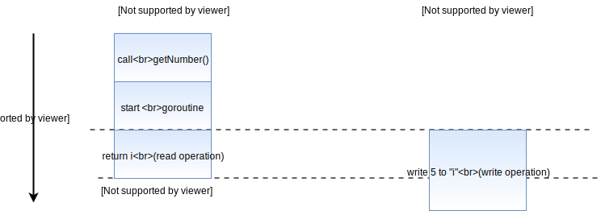
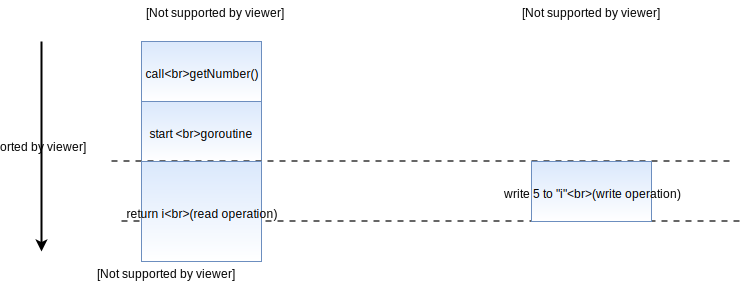

Go is known for how easy it is to build concurrent programs in it. But, with all this concurrency, comes the possibility of the dreaded data race -- one of the hardest bugs to debug if you're ever unfortunate enough to encounter it in your code.

In this post, we will go through a sample program that causes a data race, and detect the race condition with the [race detector](https://golang.org/doc/articles/race_detector.html) tool. We will then look at some of the methods to get around and solve the race condition, while still keeping the core logic of our code intact.

<!-- more -->

## Contents

1. [The data race](#the-data-race)
1. [Detecting a data race](#detecting-a-data-race)
1. [Fixing data races](#fixing-data-races)
    - [Blocking with waitgroups](#blocking-with-waitgroups)
    - [Blocking with channels](#blocking-with-channels)
    - [Returning a channel](#returning-a-channel)
    - [Using a mutex](#using-a-mutex)
1. [Conclusion](#conclusion)

## The data race

Rather than explaining what a data race is, let's look at a sample piece of code:

```go
func main() {
	fmt.Println(getNumber())
}

func getNumber() int {
	var i int
	go func() {
		i = 5
	}()

	return i
}
```
[Try it here](https://play.golang.org/p/TvaREY1QDFx)

Here, we can see that the `getNumber` function is setting the value of `i` in a separate goroutine. We are also returning `i` from the function without any knowledge of whether our goroutine has completed or not. So now, there are two operations that are taking place:
1. The value of `i` is being set to `5`
2. The value of `i` is being returned from the function

Now depending on which of these two operations completes first, our value printed will be either `0` (the default integer value) or `5`.

This is why it's called a data _race_ : the value returned from `getNumber` changes depending on which of the operations 1 or 2 finish first.


<p class="image-caption">👆 Data race with read finishing first</p>


<p class="image-caption">👆 Data race with write finishing first</p>

As you can imagine, its horrible having to test and use code which acts differently every single time you call it, and this is why data races pose such a huge problem.

## Detecting a data race

The code we went through is a highly simplified example of a data race in action. In larger applications, a data race is _much_ harder to detect on your own. Fortunately for us, Go (as of v1.1) has an inbuilt data race detector that we can use to pin point potential data race conditions.

Using it is as simple as adding a `-race` flag to your normal Go command line tools.

For example, let's try to run the program we just wrote by using the `-race` flag:

```
go run -race main.go
```

This is what I got as the output:

```
0
==================
WARNING: DATA RACE
Write at 0x00c420086008 by goroutine 6:
  main.getNumber.func1()
      /Users/soham/go/src/tmp/main.go:15 +0x3b

Previous read at 0x00c420086008 by main goroutine:
  main.getNumber()
      /Users/soham/go/src/tmp/main.go:17 +0x8e
  main.main()
      /Users/soham/go/src/tmp/main.go:9 +0x33

Goroutine 6 (running) created at:
  main.getNumber()
      /Users/soham/go/src/tmp/main.go:14 +0x7d
  main.main()
      /Users/soham/go/src/tmp/main.go:9 +0x33
==================
Found 1 data race(s)
exit status 66
```

The first `0` is the printed result (so we now know that operation 2 finished first). The next few lines give us information about the data race that was detected in out code. (The line numbers may not correspond to the sample code above since the actual code will have imports and package declarations)

We can see that the information about our data race is divided into three sections:
1. The first section tells us that there was an attempted write inside a goroutine that we created (which is where we assign the value `5` to `i`)
2. The next section tells us that was a simultaneous read by the main goroutine, which in our code, traces through the return statement and the print statement.
3. The third section describes where the goroutine that caused (1) was created.

So, just by adding a `-race` flag, the `go run` command has explained exactly what I explained in the previous section about the data race.

The `-race` flag can also be added to the `go build` and `go test` commands.

It's so easy to detect a potential race condition in Go, that I can't think of any reason _not_ to include the `-race` flag when building your Go application. The benefits _far_ outweigh the costs(if there even are any) and can contribute to a much more robust application.

## Fixing data races

Once you finally find that annoying data race, you'll be glad to know that Go offers many options to fix it. All of these solutions help to ensure that access to the variable in question is blocked if we are writing to it.

### Blocking with waitgroups

The most straightforward way of solving a data race, is to block read access until the write operation has been completed:

```go
func getNumber() int {
	var i int
	// Initialize a waitgroup variable
	var wg sync.WaitGroup
	// `Add(1) signifies that there is 1 task that we need to wait for
	wg.Add(1)
	go func() {
		i = 5
		// Calling `wg.Done` indicates that we are done with the task we are waiting fo
		wg.Done()
	}()
	// `wg.Wait` blocks until `wg.Done` is called the same number of times
	// as the amount of tasks we have (in this case, 1 time)
	wg.Wait()
	return i
}
```
[Try it here](https://play.golang.org/p/RHbGQOI3cUv)


### Blocking with channels

This method is similar in principle to the last one, except we use channels instead of waitgroups:

```go
func getNumber() int {
	var i int
	// Create a channel to push an empty struct to once we're done
	done := make(chan struct{})
	go func() {
		i = 5
		// Push an empty struct once we're done
		done <- struct{}{}
	}()
	// This statement blocks until something gets pushed into the `done` channel
	<-done
	return i
}
```
[Try it here](https://play.golang.org/p/oSnM7_7gI3X)


Blocking inside the `getNumber` function, although simple, would get troublesome if we want to call the function repeatedly. The next method follows a more flexible approach towards blocking.

### Returning a channel

Instead of using channels to block the function, we could return a channel through which we push our result, once we have it. Unlike the previous two methods, this method does not do any blocking on its own. Instead it leaves the decision of blocking up to the calling code.

```go
// return an integer channel instead of an integer
func getNumberChan() <-chan int {
	// create the channel
	c := make(chan int)
	go func() {
		// push the result into the channel
		c <- 5
	}()
	// immediately return the channel
	return c
}
```

Then, you can get the result from the channel in the calling code:

```go
func main() {
	// The code is blocked until something gets pushed into the returned channel
	// As opposed to the previous method, we block in the main function, instead
	// of the function itself
	i := <-getNumberChan()
	fmt.Println(i)
}
```
[Try it here](https://play.golang.org/p/POYn3UalH3e)


This approach is more flexible because it allows higher level functions to decide their own blocking and concurrency mechanisms, instead of treating the `getNumber` function as synchronous.

### Using a mutex

Until now, we had decided that the value of `i` should only be read _after_ the write operation has finished. Let's now think about the case, where we _don't care_ about the order of reads and writes, we only require that they _do not occur simultaneously_. If this sounds like your use case, then you should consider using a mutex:

```go
// First, create a struct that contains the value we want to return
// along with a mutex instance
type SafeNumber struct {
	val int
	m   sync.Mutex
}

func (i *SafeNumber) Get() int {
	// The `Lock` method of the mutex blocks if it is already locked
	// if not, then it blocks other calls until the `Unlock` method is called
	i.m.Lock()
	// Defer `Unlock` until this method returns
	defer i.m.Unlock()
	// Return the value
	return i.val
}

func (i *SafeNumber) Set(val int) {
	// Similar to the `Get` method, except we Lock until we are done
	// writing to `i.val`
	i.m.Lock()
	defer i.m.Unlock()
	i.val = val
}

func getNumber() int {
	// Create an instance of `SafeNumber`
	i := &SafeNumber{}
	// Use `Set` and `Get` instead of regular assignments and reads
	// We can now be sure that we can read only if the write has completed, or vice versa
	go func() {
		i.Set(5)
	}()
	return i.Get()
}
```
[Try it here](https://play.golang.org/p/SgmxIMSOtyH)

We can then use `GetNumber` just like with other cases. At first glance, this method may seem useless, since we still do not have any guarantee as to what the value of `i` will be.


<p class="image-caption">👆 Mutex with write locking first</p>


<p class="image-caption">👆 Mutex with read locking first</p>

The true value of the mutex shows when we have _multiple writes_, which are intermixed with read operations. Although, you will not need mutexes in most cases, since the previous methods work well enough, it helps to know about them for these kinds of situations.

## Conclusion

Any of the above methods will prevent the data race warning from appearing when you run a command with the `-race` flag. Each method has different trade-offs and complexity, so you'll have to evaluate the pros and cons based on your use case.

For me, if i'm ever in doubt, waitgroups normally solve the problem with the least amount of hassle.

>The core principle behind all the approaches explained in this section, is to prevent __simultaneous read and write access to the same variable or memory location__

So, as long as you keep that in mind, you're good to go 👍

