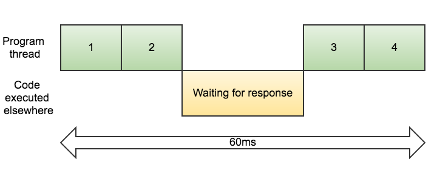
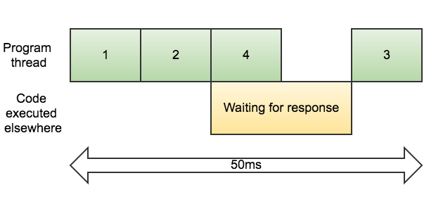
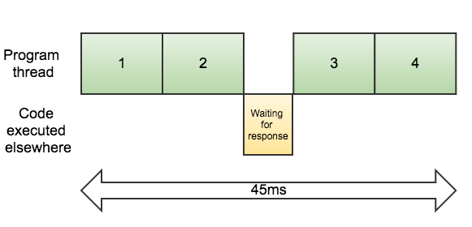
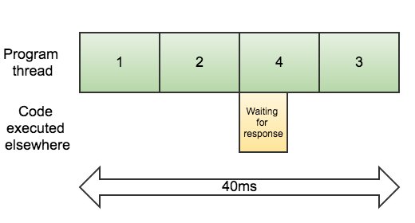

Asynchronous programming is one of those programming paradigms that's extremely difficult to fully understand, until you've done enough of it in practice. In an ideal world this shouldn't be the case, so here's yet another attempt to explain the concept of async programming, and why its different from parallel programming, in the context of javascript.

>Everything runs on a different thread *except* our code.

At first glance, this sentence doesn't seem to make a lot of sense. Isn't everything we execute technically "our code"? Well, yes and no. Lets take a look at two examples of synchronous and asynchronous implementations of the same functionality.
<!-- more -->
Synchronous implementation (python) :

```python
import requests

r = requests.get('http://sohamkamani.com')
print r.text
print "I come after the request"
```

Async implementation (js) :

```js
var request = require('request');

request('http://sohamkamani.com', function (error, response, body) {
  console.log(body);
})
console.log('I come after the request');
```

Now, all the above code runs on the same thread, no doubt about it. But what were missing is that the `request` and `requests` libraries, make http requests that go to other servers. The time spent in sending the request, processing it server side, and returning the response, is not spent in our thread. Thats what the web server you sent the request to does.  
In our python implementation, we wait for all these processes to complete and receive the response before moving on to executing the next line of code. The async philosophy adopted by javascript and Node.js is fundamentally different in this regard. Instead of waiting for the response before executing the next bit of code, we declare what we *want* to happen once we receive our response, and move on to the next bit of code as usual.  
This is why `"I come after the request"` will always get printed to the console after the response in the case of our python code, and  always get printed before the response for our javascript code<sup><a href="#footnotes">[1]</a></sup>.

>What good does any of this do me?

Both the snippets of code are exactly similar in their functionality :

1. `import requests` == `var request = require('request');`
1. `r = requests.get('http://sohamkamani.com')` == `request('http://sohamkamani.com', ... )`
1. `print r.text` == `console.log(body);`
1. `print "I come after the request"` == `console.log('I come after the request');`

Let us assume, for the sake of experimentation, that each of the 4 snippets of code above take ~10ms to execute. Since we are only here to see the power of async, we are not going to take the raw execution speed of either language into consideration, and assuming the synchronous parts of both examples to have the same execution time (of 10ms). We will also take two cases of waiting time into consideration, one of 20ms, and one of 5ms.

#### Case 1 (Waiting time = 20ms)

With synchronous execution :  


With asynchronous execution :  


Snippet 4 doesn't have to wait for our response to arrive in order to execute, but snippet 3 does. Our javascript code handles this by defining tasks that need to wait inside the callback and other tasks outside of it. In the case of our python example, all code after we send the request is blocked until the response arrives.  
This gives us a *net loss of **10ms*** in this case for the synchronous implementation.

#### Case 2 (Waiting time = 5ms)

With synchronous execution :  


With asynchronous execution :  


Synchronous execution with a smaller waiting time doesn't look much different from the last picture, but the asynchronous timing diagram is pretty interesting. We see that snippet 4 starts execution as usual during waiting time, but snippet 3 doesnt execute right after the waiting time is over. **This is because snippet 3 and snippet 4 are running on the same thread** and hence snippet 3 has to wait for 4 to finish before it can start. This is a much better illustration of what it means to be *single threaded and asynchronous*.

### Final thoughts

>If async is so obviously the correct thing to do, then why should we bother with synchronous programming?

The first thing that stands out in the javascript code snippet is that it's *much less simple* than the corresponding python snippet, and so takes a bit more time to read, understand, and develop. In fact, there are many articles and [blog posts](/blog/2015/08/21/understand_node_without_losing_your_mind/) dedicated to managing async code, because without proper management, it can all get out of hand pretty quickly.

For rapid prototypes, or in cases where speed and timing is not the main concern, going the synchronous way can be more productive. On the other hand, if you're planning to build an application with a lot of I/O and networking tasks, or with a lot of users, then the power of async really starts to shine.

Although async is not embedded in pythons "philosophy", like it is with NodeJs, there are many libraries which let you leverage event driven and async programming, like the [Twisted](https://twistedmatrix.com/trac/) library.

---
<span id="footnotes" class="footnotes">
*[1] Edit - Javascript always finishes the currently executing function first. Thanks @Twitchard for the correction.*
</span>
