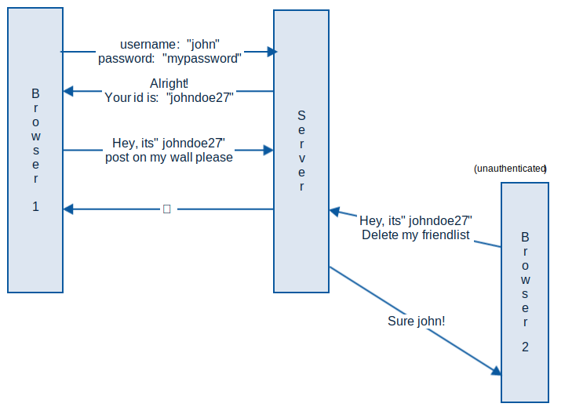
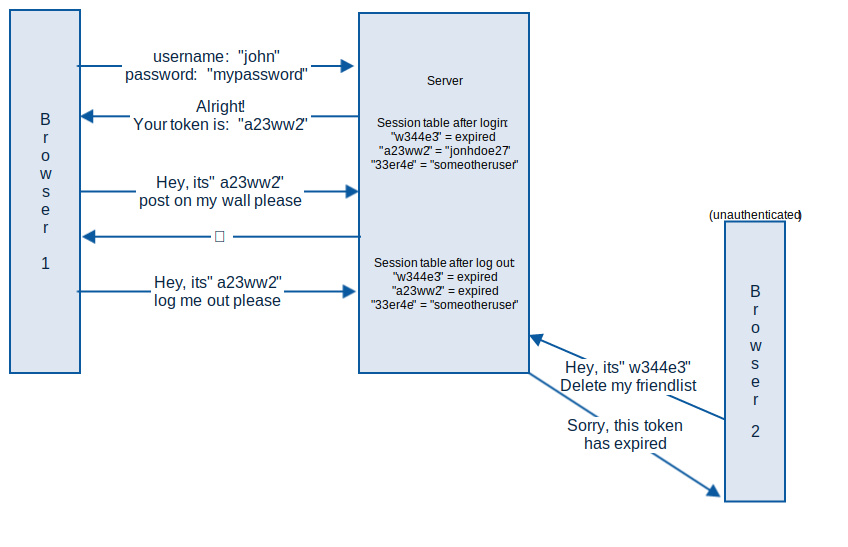

Irrespective of what type of website you're making, if there is a login and authentication involved, you will definitely be dealing with sessions and cookies.

One question that kept me wondering while learning about this myself was : How on earth does the server respond to every users requests uniquely? How does it know which user is sending each request?

<!-- more -->

One option is to send the browser information about the user just as they login. The browser will then store this information, and send it along with every subsequent request so that the server knows where it's coming from. The obvious problem with this is that it isn't secure. Any other browser (perhaps one that the user logged into previously) could also make a request with with this id and compromise the users security.

We need something more... temporary.

## Enter : the session token

It is in our best interest to give as little information about the user to the browser as possible. In line with this, instead of giving the user their information on login, we will instead give them a piece of text called the "session token".

> A "session" is a single interval of time in which the user is authenticated.

What makes this secure is that each session comes with a different session token, and the session token by itself gives no indication about the person who is logged in.

Now, each time John makes a request from his browser, he sends his current session token along with the request. The server has kept a note internally about which session token maps to which user. Once the user logs out (or logs in again), or after a specified period of time, a new session token is generated and assigned, while the old token expires.

In the above picture "Browser 2" is where John previously logged in from. The token for that session was `w344e3` , which has now expired. Once John logs out from "Browser 1", his current session token (`a23ww2`) expires as well. There is no way for any 3rd party to guess which session maps to which user since that information is stored safely on the server and is not made public.

There is still something missing though. The user _always_ has to mention their session token with _every_ request they make. In addition to looking annoying, this has some practical disadvantages as well : anyone developing the client side code has to make sure to explicitly attach the session cookie with every request. If only there was a way to automatically attach this information with every request.

## Cookies to the rescue

This is why we need cookies. In a nutshell, a cookie is a small piece of data kept with the browser, which (if the request comes from the same domain) is sent with every request automatically.

In our case, the cookie would be the session token (since that's all that the server really needs). The exchange between the browser and the server would be the same as before, except the request from the browser would not need to explicitly specify the session token everytime.

Cookies are normally set once the user logs in, and come with an expiry time. Since cookies follow a protocol supported by most browsers, there is nothing special to be done from our side to set their value and expiry time.

If you want to see the cookies currently stored for the current website you are visiting (like this one) right click anywhere on the page and click on "inspect" to open the developer tools (if you are on chrome). Next, go to the application tab and click on the cookies section under that.

If you want to learn more about security on the web, be sure to read my [other posts on web security essentials](/blog/2017/01/16/web-security-essentials/) :

[SQL Injection](/blog/2016/11/24/what-is-sql-injection/)  
[CORS (Cross origin resource sharing)](/blog/2016/12/21/web-security-cors/)  
[XSS (Cross site scripting)](/blog/2016/11/24/web-security-xss/)  
[Password Storage](/blog/2017/01/01/web-security-password-storage/)  
[CSRF (Cross site request forgery)](/blog/2017/01/14/web-security-cross-site-request-forgery/)  
[Human Error and UI/UX design](/blog/2017/01/14/web-security-human-error/)
